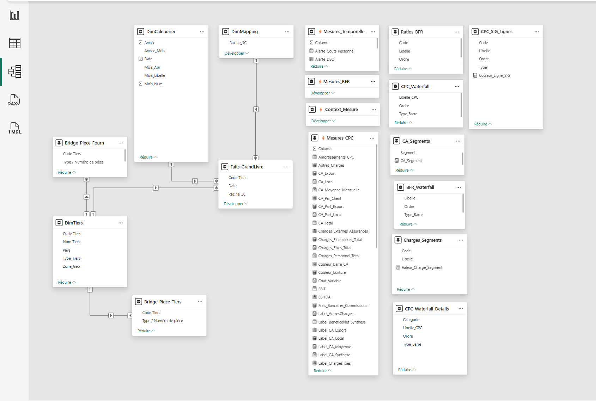

# Reporting Financier — Tableau de Bord Power BI | Mission Client Réelle

> **Vrai client · Données SAGE ERP · 100+ mesures DAX · Actualisé en production**  
> 4 000+ écritures comptables · 15+ tables · Star Schema + Bridge tables · 7 pages

🇬🇧 [English version available here](README.md)

---

## Contexte Client

**Secteur :** Entreprise marocaine — distribution & services  
**Interlocuteur principal :** Responsable Administratif et Financier (RAF)  
**Période :** Février – Avril 2026  
**Statut :** Livré en production, actualisé automatiquement sur Power BI Service

> *Les données et visuels du dashboard ne sont pas partagés publiquement
> par respect de la confidentialité client. Ce dépôt documente l'architecture,
> la modélisation et la logique métier.*

---

## Problème Business

Le RAF produisait ses reportings financiers manuellement sur Excel :
processus long, source d'erreurs, et peu exploitable en réunion de direction.

**Conséquences concrètes :**
- Délai de clôture mensuel élevé
- Indicateurs financiers difficiles à lire rapidement pour la direction
- Aucune visibilité temps réel sur la trésorerie et le BFR
- Données SAGE sous-exploitées — aucun pipeline structuré

**Mission :** Transformer les exports SAGE en outil de pilotage financier
dynamique, adopté immédiatement par le RAF et la direction.

---

## Solution Livrée

### Pipeline ETL — SAGE vers Power BI
- Extraction des exports SAGE (Excel multi-fichiers)
- Nettoyage et normalisation : classes de comptes, racines comptables, détection des extournes
- Contrôles de cohérence et règles de qualité des données
- Détection et correction d'anomalies inter-périodes
- Actualisation automatisée sur Power BI Service

### Modèle de Données — Star Schema avec Bridge Tables

Architecture optimisée pour la performance et la scalabilité :

```
Table de faits
└── Faits_GrandLivre       → 4 000+ écritures comptables SAGE

Tables de dimensions
├── DimCalendrier           → analyse temporelle
├── DimTiers                → clients & fournisseurs
└── DimMapping              → classification comptable (PCGE)

Tables de liaison (Bridge)
├── Bridge_Piece_Tiers      → attribution du CA aux clients
└── Bridge_Piece_Fourn      → attribution des achats aux fournisseurs

Tables déconnectées
└── Segmentation, waterfall, logique métier avancée
```



### Mesures DAX — 100+ mesures développées

**Rentabilité**

| Mesure | Description |
|---|---|
| `CA_Total` | Chiffre d'affaires total (Export + Local) |
| `Marge_Brute` | CA - Coût des ventes |
| `EBITDA` | Marge Brute - Charges Personnel - Charges Fixes |
| `Résultat_Net` | Résultat après toutes charges et impôts |

**Trésorerie & BFR**

| Mesure | Description |
|---|---|
| `BFR` | Créances + Stock - Dettes fournisseurs - Dettes fiscales |
| `DSO` | Créances clients / (CA / 365) — délai moyen de recouvrement |
| `DPO` | Dettes fournisseurs / (Charges / 365) — délai paiement fournisseurs |
| `DIO` | Stock / (Coût Variable / 365) — rotation des stocks en jours |
| `Cash_Runway_Mois` | Mois de trésorerie disponibles au rythme de dépenses actuel |

**Analyses avancées**
- Alertes dynamiques sur les écarts de KPIs (seuils définis avec le RAF)
- Analyse de concentration clients
- Drill-through jusqu'aux écritures individuelles du Grand Livre
- Waterfall P&L (CA → Résultat Net)
- Segmentation dynamique clients / fournisseurs / géographie

---

## Dashboard — 7 Pages

| Page | Contenu |
|---|---|
| 1 — Vue Exécutive | KPIs synthétiques · Performance globale · Alertes direction |
| 2 — Compte de Résultat (CPC) | Waterfall CA → Résultat Net · Analyse des marges |
| 3 — Analyse CA & Tiers | Répartition Export/Local · Top clients · Concentration |
| 4 — Analyse des Charges | Structure des coûts · Évolution · Écarts |
| 5 — BFR & Trésorerie | DSO · DPO · DIO · Cash Runway · Alertes liquidité |
| 6 — Détail Grand Livre | Drill-through jusqu'aux écritures SAGE individuelles |
| 7 — Commentaires Direction | Espace de saisie pour annotations en réunion de direction |

---

## Impact Métier

| Résultat | Détail |
|---|---|
| Adoption immédiate | Prise en main par le RAF et la direction dès la livraison |
| Délai de clôture réduit | Réduction mesurable du temps de production des reportings mensuels |
| Reporting standardisé | Passage d'Excel manuel à un outil de pilotage dynamique |
| Formation livrée | Vidéos de prise en main + guide d'utilisation & d'actualisation |
| Règles documentées | Toutes les mesures DAX et règles métier documentées pour une utilisation reproductible |

---

## Stack Technique

- **Power BI Desktop + Power BI Service** — développement & déploiement en production
- **DAX** — 100+ mesures calculées
- **Power Query / M** — pipeline ETL depuis exports SAGE
- **Excel** — source de données (exports SAGE multi-fichiers)
- **Star Schema + Bridge Tables** — modélisation dimensionnelle avancée

---

## Documentation

| Document | Contenu |
|---|---|
| [DAX_MEASURES.md](DAX_MEASURES.md) | Code complet des mesures DAX par catégorie |
| [METHODOLOGY.md](METHODOLOGY.md) | Architecture, pipeline ETL, choix de modélisation |
| [Schema_Etoile.png](Schema_Etoile.png) | Schéma du modèle de données |

---

## Structure du Repository

```
cmgp-financial-dashboard/
├── README.md                  # Version anglaise
├── README_FR.md               # Ce fichier
├── DAX_MEASURES.md
├── METHODOLOGY.md
├── Schema_Etoile.png
└── pbix/
    └── (non partagé — données client confidentielles)
```

---

## Auteur

**Boubacar Nikiema** — Data Analyst & Consultant BI

Spécialisé en dashboards financiers, reporting de gestion et pipelines ETL
avec Power BI, SQL, Python et Excel. Basé au Maroc, j'interviens auprès
d'entreprises en Afrique et en Europe francophone.

[](https://linkedin.com/in/boubacar-nikiema)
[](https://youtube.com/@BoubacarDataAnalyst)
[](mailto:nikiemaboubacar@gmail.com)
[](https://data.ngroupmediadigital.com)

---

Vous souhaitez automatiser votre reporting financier ou mettre en place
un pilotage par la donnée ? Contactez-moi.

---

*Mission client réelle · Données confidentielles non partagées · Code : MIT License*
